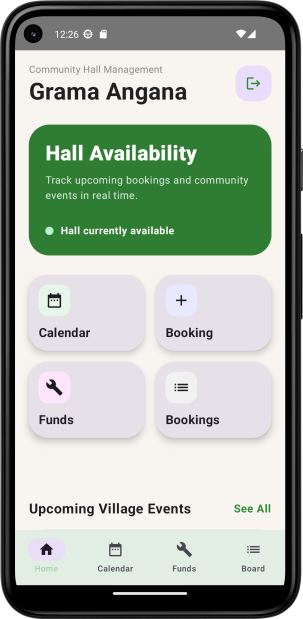
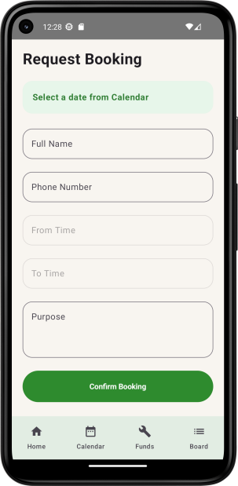

# Grama Angana

Grama Angana is a modern Android application built for managing community halls and village events digitally. The app helps users book halls, view upcoming events, manage community activities, and track hall availability in real time.

## Features

### User Authentication

* Firebase Authentication
* Login and Signup functionality
* Password visibility toggle
* Secure user-based booking system

### Hall Booking System

* Book community hall slots
* Select booking date from calendar
* Choose booking start and end time
* Cancel bookings instantly
* Real-time booking updates using Firestore

### Smart Calendar

* Month and year navigation
* Real weekday-aligned calendar
* Booked dates highlighted
* Available slots shown dynamically

### Community Events

* View village/community events
* Featured event section
* Event categories and organizers
* Dynamic event data from Firebase Firestore

### Dashboard

* Hall availability status card
* Upcoming bookings preview
* Quick navigation grid
* Modern interactive UI

### Maintenance & Funds

* Track maintenance/fund information
* Modern card-based layout

## Tech Stack

* Kotlin
* Jetpack Compose
* Firebase Authentication
* Firebase Firestore
* Material 3
* Android Studio

## Firebase Services Used

* Firebase Authentication
* Cloud Firestore

## Screens Included

* Login/Signup
* Home Dashboard
* Event Calendar
* Booking Screen
* Community Events Board
* Bookings Screen
* Maintenance/Funds Screen

## UI Highlights

* Modern Material 3 design
* Interactive clickable cards
* Smooth animations
* Responsive layouts
* Scrollable screens
* Real-time Firestore integration

## Future Improvements

* Push notifications
* Admin role management
* Booking conflict detection
* Event creation from app
* Dark mode
* Image uploads using Firebase Storage

## Download APK

You can directly download and install the latest APK release here:

[https://github.com/puchic/grama-angana/releases/download/v1/grama_angana_v1.0.apk](https://github.com/puchic/grama-angana/releases/download/v1/grama_angana_v1.0.apk)

## GitHub Repository

[https://github.com/puchic/grama-angana](https://github.com/puchic/grama-angana)

## Screenshots

